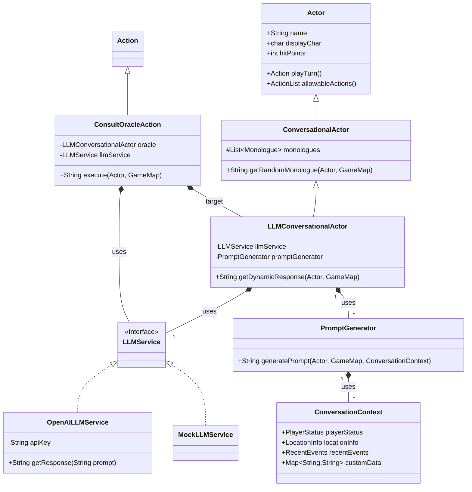
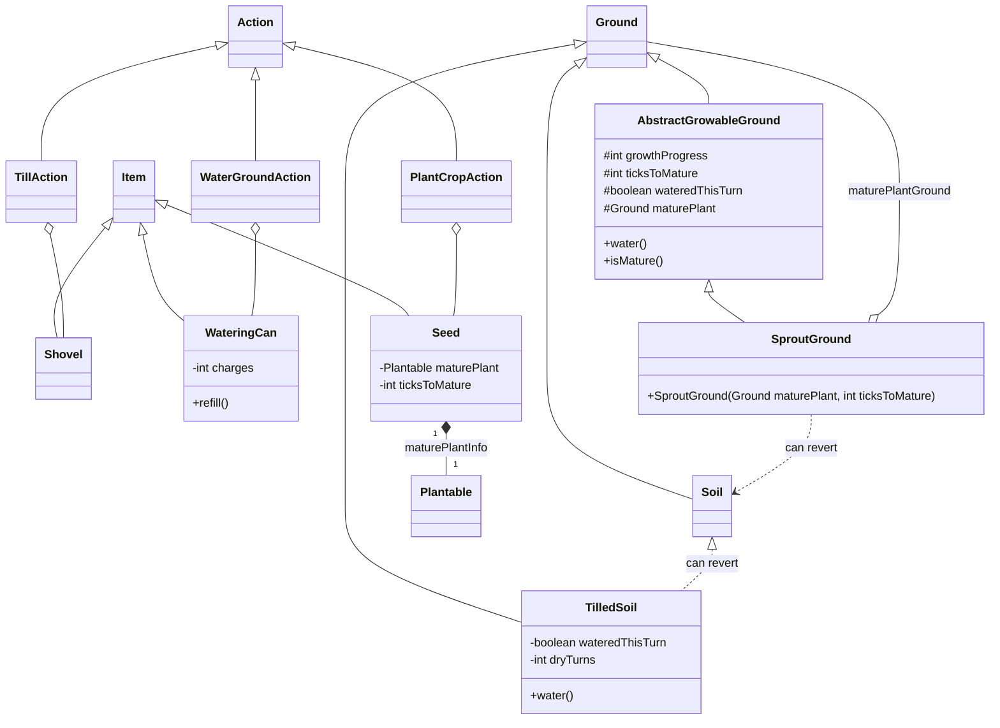

# FIT2099 Assignment (Semester 1, 2025)

```
`7MM"""YMM  `7MMF'      `7MM"""Yb. `7MM"""YMM  `7MN.   `7MF'    MMP""MM""YMM `7MMF'  `7MMF'`7MMF'`7MN.   `7MF' .g8"""bgd  
  MM    `7    MM          MM    `Yb. MM    `7    MMN.    M      P'   MM   `7   MM      MM    MM    MMN.    M .dP'     `M  
  MM   d      MM          MM     `Mb MM   d      M YMb   M           MM        MM      MM    MM    M YMb   M dM'       `  
  MMmmMM      MM          MM      MM MMmmMM      M  `MN. M           MM        MMmmmmmmMM    MM    M  `MN. M MM           
  MM   Y  ,   MM      ,   MM     ,MP MM   Y  ,   M   `MM.M           MM        MM      MM    MM    M   `MM.M MM.    `7MMF'
  MM     ,M   MM     ,M   MM    ,dP' MM     ,M   M     YMM           MM        MM      MM    MM    M     YMM `Mb.     MM  
.JMMmmmmMMM .JMMmmmmMMM .JMMmmmdP' .JMMmmmmMMM .JML.    YM         .JMML.    .JMML.  .JMML..JMML..JML.    YM   `"bmmmdPY  
```
## Contribution Log
[Contribution Log](https://docs.google.com/spreadsheets/d/1gY31ceq3zFlml2lFmm20qJjxKAHnyYOaSGsYnuyJ8es/edit?gid=1582995291#gid=1582995291)


# ASSIGNMENT 3 IMPLEMENTATION
## REQ3: Creative Mode – The Oracle of Eldoria (LLM-Powered NPC)

### 1. Scenario / Story
In the mystical lands of Eldoria, a new, enigmatic figure has appeared – **The Oracle of Whispers**. This ancient being, found in a secluded, shimmering grove, does not speak in pre-ordained scripts. Instead, its consciousness is vast, drawing upon an external wellspring of knowledge (an LLM API) to offer unique insights, cryptic prophecies, and reactive commentary on the world and the player's journey.

When the player approaches and chooses to **Consult** the Oracle, the game constructs a prompt based on the current game state (player’s health, inventory, location, recent events). This prompt is sent to an LLM service, and the Oracle speaks the returned wisdom: philosophical musings, warnings, or cryptic clues tailored to the playthrough.

---

### 2. Implemented Features

- **LLM-Powered Conversational NPC**
    - New NPC class **LLMConversationalActor** (“The Oracle”), fetching dialogue from an external LLM service.
- **Context-Aware Dialogue Generation**
    - **PromptGenerator** builds prompts from `Actor` status, `GameMap` location, and `ConversationContext`.
- **Abstracted LLM Service**
    - `LLMService` interface with implementations (e.g., `OpenAILLMService`, `MockLLMService`) for flexibility and testing.
- **“Consult” Action**
    - `ConsultOracleAction` triggers dynamic dialogue instead of static monologues.

---

### 3. Design Documentation

#### 3.1. Class Diagram (Conceptual)


#### 3.2. New Classes

1. **LLMConversationalActor**
    - Extends `Actor` (or `ConversationalActor`)
    - Holds `LLMService` & `PromptGenerator`
    - Overrides `allowableActions()` to include `ConsultOracleAction`

2. **LLMService** (interface)
    - `String getResponse(String prompt)`

3. **OpenAILLMService** / **MockLLMService**
    - Implements `LLMService`; handles API calls or returns mock data

4. **PromptGenerator**
    - Builds context-rich prompt strings for LLM queries

5. **ConsultOracleAction**
    - Extends `Action`; invokes LLMConversationalActor’s prompt + LLMService to get and display the response

6. **ConversationContext**
    - POJO encapsulating game-state data: health, inventory, location, recent events

#### 3.3. Engine Components Used

- **edu.monash.fit2099.engine.actors.Actor**
- **edu.monash.fit2099.engine.actions.Action** & **ActionList**
- **edu.monash.fit2099.engine.positions.GameMap**
- **edu.monash.fit2099.engine.displays.Display**

#### 3.4. Design Justification

- **SRP**: Each class (Actor, Service, PromptGenerator, Action, Context) has one responsibility.
- **OCP**: Can add new LLM providers or context types without modifying existing core logic.
- **LSP**: Any `LLMService` impl can replace another; `LLMConversationalActor` substitutes for `Actor`.
- **ISP**: `LLMService` is narrowly scoped.
- **DIP**: High-level actor depends on the `LLMService` abstraction.

**Drawbacks:**
- External API dependency (connectivity, cost, latency).
- Added complexity and testing overhead.
- Potential for nonsensical or inappropriate LLM responses.

**Alternatives Considered:**
- Monolithic actor handling API & prompt logic (violates SRP).
- Pre-populating monologues with LLM responses (loses on-demand dynamism).

---

### 4. Testing Instructions

1. **Setup & Placement**
    - Configure API key or mock service.
    - Place `LLMConversationalActor` in game world.

2. **Interaction Flow**
    - Approach Oracle; ensure “Consult The Oracle” is in action menu.
    - Execute action; observe “thinking…” then dynamic response.

3. **Context Variation**
    - Vary health, inventory, location; confirm prompts include these changes.
    - Log prompts for debugging.

4. **Mock Service Testing**
    - Swap in `MockLLMService`; ensure predictable responses appear.

5. **Error Handling**
    - Simulate API failure; Oracle should respond gracefully (e.g., “The mists are cloudy…”).

---

---

## REQ4: Creative Mode – Realistic Farming System

### 1. Scenario / Story
Eldoria’s farmers must now truly **cultivate** their fields. Players must **till** soil, **plant** seeds into fertile land, **water** sprouts, and patiently wait for maturity—avoiding withering or soil reversion. Each crop evolves through stages, making harvesting a rewarding achievement.

---

### 2. Implemented Features

- **Ground Tilling**
    - **TilledSoil** ground type via `Shovel` + `TillAction`.
- **Plant Growth Stages**
    - **SproutGround** represents seedlings, maturing after N turns.
- **Watering Mechanic**
    - **WateringCan** + `WaterGroundAction` to hydrate soil/sprouts.
    - Drying causes wither (Sprout → Soil) or reversion (TilledSoil → Soil).
- **Modified Seed & Planting**
    - `Seed` holds `ticksToMature` and mature-plant info.
    - `PlantCropAction` now creates `SproutGround` instead of instant plant.

---

### 3. Design Documentation

#### 3.1. Class Diagram (Conceptual)


#### 3.2. New Classes

1. **AbstractGrowableGround** (abstract)
    - Extends `Ground`; manages growthProgress, ticksToMature, watering state, and maturity transition.

2. **SproutGround**
    - Extends `AbstractGrowableGround`; handles growth ticks and death if unwatered.

3. **TilledSoil**
    - Extends `Ground`; must be watered or will revert to `Soil`.

4. **WateringCan**
    - Extends `Item`; holds water charges, provides `WaterGroundAction`.

5. **WaterGroundAction**
    - Extends `Action`; waters `TilledSoil` or `SproutGround`.

6. **Shovel** & **TillAction**
    - Converts `Soil` → `TilledSoil`.

7. **Modified Seed & PlantCropAction**
    - `Seed` stores maturity info; planting creates `SproutGround`.

#### 3.3. Engine Components Used

- **edu.monash.fit2099.engine.positions.Ground**
- **edu.monash.fit2099.engine.items.Item**
- **edu.monash.fit2099.engine.actions.Action**
- **edu.monash.fit2099.engine.positions.Location & GameMap**
- **edu.monash.fit2099.engine.displays.Display**

#### 3.4. Design Justification

- **SRP**: Each class has a focused role (ground state, growth logic, watering, tilling).
- **OCP**: New plants or tools (e.g., Fertilizer) plug in without changing core logic.
- **LSP**: Ground subtypes interchangeable; `SproutGround` fits `AbstractGrowableGround`.
- **ISP**: Actions and items expose only needed interfaces.
- **DIP**: High-level game logic depends on `Ground` abstractions, not concrete implementations.

**Drawbacks:**
- Added complexity and per-tile ticking overhead.
- More micromanagement for players.

**Alternatives Considered:**
- Plants as items instead of ground (loses positional fidelity).
- Global manager vs. per-tile tick (chose idiomatic `Ground.tick()`).

---

### 4. Testing Instructions

1. **Acquire Tools & Seeds**
    - Obtain `Shovel`, `WateringCan`, various `Seed` items.

2. **Tilling**
    - Use `TillAction` on `Soil` → check tile becomes `TilledSoil`.

3. **Planting**
    - Plant `Seed` on `TilledSoil` → becomes `SproutGround`; seed consumed.

4. **Watering**
    - Use `WaterGroundAction`; check watering charges decrease, ground is hydrated.

5. **Growth & Withering**
    - Water regularly and observe `SproutGround` → mature plant after N turns.
    - Skip watering to see wither (ground reverts).

6. **Soil Reversion**
    - Leave `TilledSoil` unplanted/unwatered; verify reversion to `Soil`.

7. **Edge Cases**
    - Plant on non-tilled ground (fail), water with empty can (fail), insufficient energy.

---