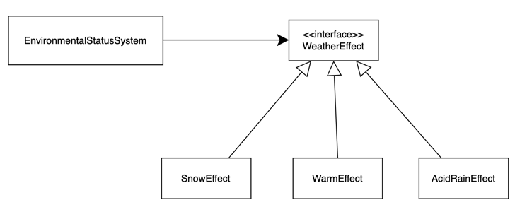
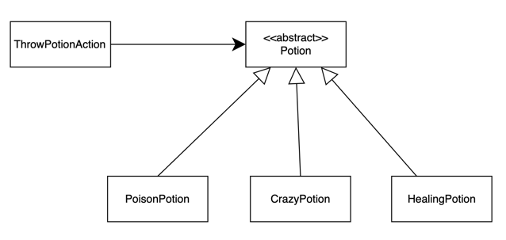

# FIT2099 Assignment (Semester 1, 2025)

```
`7MM"""YMM  `7MMF'      `7MM"""Yb. `7MM"""YMM  `7MN.   `7MF'    MMP""MM""YMM `7MMF'  `7MMF'`7MMF'`7MN.   `7MF' .g8"""bgd  
  MM    `7    MM          MM    `Yb. MM    `7    MMN.    M      P'   MM   `7   MM      MM    MM    MMN.    M .dP'     `M  
  MM   d      MM          MM     `Mb MM   d      M YMb   M           MM        MM      MM    MM    M YMb   M dM'       `  
  MMmmMM      MM          MM      MM MMmmMM      M  `MN. M           MM        MMmmmmmmMM    MM    M  `MN. M MM           
  MM   Y  ,   MM      ,   MM     ,MP MM   Y  ,   M   `MM.M           MM        MM      MM    MM    M   `MM.M MM.    `7MMF'
  MM     ,M   MM     ,M   MM    ,dP' MM     ,M   M     YMM           MM        MM      MM    MM    M     YMM `Mb.     MM  
.JMMmmmmMMM .JMMmmmmMMM .JMMmmmdP' .JMMmmmmMMM .JML.    YM         .JMML.    .JMML.  .JMML..JMML..JML.    YM   `"bmmmdPY  
```
## Contribution Log
[Contribution Log](https://docs.google.com/spreadsheets/d/1gY31ceq3zFlml2lFmm20qJjxKAHnyYOaSGsYnuyJ8es/edit?gid=1582995291#gid=1582995291)


# ASSIGNMENT 3 IMPLEMENTATION
## 🌍 Introduction: Weather Madness

Welcome to the wild and wondrous lands of *Elden Thing*, where the skies are as unpredictable as the creatures that roam beneath them. One moment, the sun gently warms your journey. The next, you're drenched in acidic rain, torch extinguished, health slipping away. Here, **the weather isn’t just a backdrop—it’s a living system, one that tests your preparation, resilience, and strategy**.

☀️❄️🌧️ **Sun don't wait. Snow doesn't ask. Acid rain doesn’t care.**

To bring this brutal realism to life, we’ve built a **dynamic Weather System** that transforms each turn into a tactical choice. Will you brace for the cold with a flickering torch? Or risk it all, umbrella snapped open, praying it lasts just one more tick of acid rain?

This system is powered by an elegant architecture:

- A **Singleton Weather Controller** tracks and transitions weather based on time and probability.
- Modular **WeatherEffect** subclasses define unique gameplay impacts—like freezing players or corroding their health.
- Limited-use **protection items** (Torch, Umbrella) give players a fighting chance—but only for so long.

Much like the spirit goats and golden beetles of Limveld choose their behaviors each turn, the **weather itself chooses how to act**—sometimes predictably, sometimes chaotically. And you, brave player, must respond.

Designed with scalability in mind (and more than a few sneaky surprises for future expansion), this system blends **gameplay challenge** with **object-oriented elegance**, ensuring that your next encounter with the sky is never just "bad weather"—it’s a new kind of boss fight.

---

## UML Diagram


## 🌦️ Weather System Core Classes

🎮 **System Controller**

🔄 **EnvironmentalStatusSystem** (Singleton)

- Controls weather transitions and effects
- Manages weather duration and change probability
- Notifies player of weather changes
- Applies weather effects each turn

---

## 🌪️ Weather Effects

📋 **WeatherEffect** (Abstract)

- Base class for all weather effects
- Defines interface for weather-specific effects
- Manages effect application logic
- Provides weather status information

🌨️ **SnowEffect**

- Reduces player temperature each turn
- Causes unconsciousness if temperature is unsafe
- Can be countered by Torch item

☔ **AcidRainEffect**

- Deals damage to player each turn
- Extinguishes lit torches
- Can be blocked by Umbrella item

☀️ **WarmEffect**

- Normal weather conditions
- No negative effects on player

---

# 💡 Additional Classes to Support

## 🎒 Protection Items

🔥 **Torch**

- Provides warmth during snow
- Limited to 3 uses
- Can be extinguished by acid rain

☂️ **Umbrella**

- Protects against acid rain
- Can be opened/closed
- Limited to 3 uses

---

## ⚔️ Actions

🔥 **UseTorchAction**

- Handles torch lighting/extinguishing
- Manages torch use count
- Provides warmth effect

☔ **UseUmbrellaAction**

- Controls umbrella opening/closing
- Manages umbrella use count
- Provides rain protection

---

## 🔄 System Flow

**Initialization**

- EnvironmentalStatusSystem created with player and map
- Initial weather effect selected

**Per Turn Processing**

- Weather duration tracked
- Weather changes checked (60% chance after 5 turns)
- Current weather effect applied to player

**Protection Items**

- Players can use Torch or Umbrella
- Items provide temporary protection
- Limited use counts tracked

**Effect Application**

- Weather effects check for protection
- Unprotected players receive damage/effects
- Status messages displayed to player

---

## 🎯 Key Features

- **Weather Variety:** Three distinct weather types
- **Protection System:** Multiple protection items
- **Limited Resources:** Item use restrictions
- **Visual Feedback:** Colored weather messages
- **Dynamic Changes:** Random weather transitions

---

## 📚 Case Scenario

### ❄️ Snowstorm Survival with Torch

**Context:**

The player enters a cold biome while the **SnowEffect** is active.

**Progression:**

- **Turn 1:** Weather message displays: “heavy snow rages...” Player’s temperature drops.
- **Turn 4:** Player can use the **Torch** to restore temperature.
- **Turn 5–6:** Snow continues. Player stays warm with the Torch, but Torch’uses decrease.
- **Turn 7:** Torch is depleted. If not protected, the player becomes unconscious due to hypothermia.

**Outcome:**

Demonstrates the dynamic interaction between **SnowEffect** and the **Torch**, highlighting the need for timely protection and resource management.

---

## REQ4: Witch Mayhem of Potions

## 🧪 Potion System Overview

🎩 Welcome to the alchemist’s playground—where bubbling cauldrons and shimmering vials hold the power to heal, harm, or unhinge anyone daring enough to sip—or hurl—them. In the world of Elden Thing, potions are more than mere consumables; they’re tactical tools, chaotic gambits, and sometimes the final hope in a desperate skirmish.

Behind every flask lies a tale of perilous gathering: sneaking through shadowy groves to pluck Blessed mushrooms under moonlight, or wading into cursed swamps to harvest glowing Cursed blooms🌿. Each ingredient carries danger⚠️—a wrong step might awaken a hidden wraith, or trigger a cloud of hallucinogenic spores. But the thrill of discovery is only rivaled by the joy of returning to your ramshackle guild workshop, ingredients in hand, ready to transmute them into something extraordinary.

This is where the true artistry begins. Your Pouch becomes a painter’s palette🎨, blending Blessed, Cursed, and Drinkable components to craft healing draughts, poison bombs, or brews that twist the mind itself. Brewing isn’t a simple button press—it’s a delicate ritual demanding patience and precision. Too much of one herb, and your potion may turn to useless sludge. Too little, and the effects might spiral out of control. Every success is a triumph✨; every failure, a humbling lesson.

Once a potion rests in your inventory, new decisions emerge. Will you sip a Healing Potion before the next ambush? Slip a Poison Potion into a rival’s flask? Or lob a Crazy Potion into a crowd and watch chaos unravel🌀? Every choice matters—a mistimed toss could strike an ally, while an empty bottle at a crucial moment could seal your fate💀. In Elden Thing, potions are as much about strategy as they are about risk.

This system was crafted not just to deepen combat, but to intertwine alchemy with exploration and lore. Tome-keepers in hidden libraries whisper of forgotten reagents locked in ancient vaults. Wandering merchants offer recipe fragments for a king’s ransom. As the world of Elden Thing expands—through new biomes, lost ruins, or arcane discoveries—so too will the horizons of potioncraft.

Whether you’re a battlefield tactician, a cunning saboteur, or a mad scientist on the brink, the alchemist’s cauldron🔥 awaits your hand.

---
## UML Diagram

---

## 📚 Core Classes

### 🧪 Potion (Abstract Class)

*Applied to `Item.java`*

- Base class for all potion items
- Defines shared behaviors for drinking and throwing
- Applies status effects either directly (on drink) or area-based (on throw)
- Follows the **Template Method** design pattern to structure effect application

---

## 🌟 Potion Types

*Each class extends `Potion`, providing unique effects and values.*

### ❤️ Healing Potion

- Restores a moderate amount of health when drunk
- Slight healing effect when thrown, affecting nearby allies

### ☠️ Poison Potion

- Damages the target when consumed
- Weaker area damage when thrown at enemies

### 🤪 Crazy Potion

- Applies a disorienting effect for a set number of turns
- Alters behavior or stats during the effect’s duration

---

## ⚔️ Potion Actions

### 🎯 ThrowPotionAction

*Allows a player to throw a potion onto the map.*

- Applies the potion’s area effect to surrounding actors
- Effect strength usually weaker than direct consumption
- Uses the `throwPotion()` method defined in `Potion`

# 💡 Additional Classes to Support

### 🥤 DrinkPotionAction

*Allows a player to consume a potion.*

- Triggers the potion’s `drink()` method
- Applies immediate effect (e.g., heal, damage)

---

## ✨ Effects

### 🌈 Status Effects

*Abstracted under a `StatusEffect` class.*

- **HealingEffect**: Gradual or immediate HP recovery
- **PoisonEffect**: Causes damage over time
- **CrazyEffect**: Temporarily alters the actor's behavior or stats

Each effect is applied via ticking (`tick()`), influencing the actor over several turns.

---

## 🎒 Brewing System

### 💼 Pouch

*Acts as a crafting toolkit for the player.*

- Manages inventory of ingredients (e.g., “Blessed”, “Cursed”, “Drinkable”)
- Offers valid brewing actions based on available materials
- Handles consumption of ingredients when a potion is brewed

### 🧪 Brewing Actions

- **BrewHealingPotionAction**: Requires 1x Blessed + 1x Drinkable
- **BrewPoisonPotionAction**: Requires 1x Cursed + 1x Drinkable
- **BrewCrazyPotionAction**: Requires 3x Blessed + 2x Drinkable

These actions are shown to the player based on inventory contents.

---

## 🔄 System Flow

### 1. 📥 Ingredient Collection

- Players gather components tagged with relevant capabilities (Blessed, Cursed, Drinkable)

### 2. 🧪 Potion Brewing

- The player uses a Pouch to create brewing actions
- Valid actions become available depending on ingredients

### 3. 🎯 Potion Usage

- Players can **drink** for strong effects or **throw** for AoE (area-of-effect) utility

### 4. ✨ Effect Application

- Effects are instantiated via the potion and applied to the actor
- Effects run each turn using the `tick()` method

---

## 🎯 Design Patterns

### 📐 Template Method

- Used in the `Potion` class to standardize the throw logic while allowing potion-specific effects via overrides

### 🎮 Command Pattern

- Each potion-related action (e.g., Drink, Throw, Brew) is encapsulated as a command object, enabling flexible use and undo potential

### 🔄 Strategy Pattern

- Effects like HealingEffect and PoisonEffect implement their own logic under a shared interface (`tick()`)

### 🏭 Factory Method

- Each potion defines its own way of generating an effect using `createEffect()`

---

## 🌟 Key Features

- **Versatile Effects**: Multiple potion types with unique mechanics
- **Area Effects**: AoE application through throwing
- **Crafting System**: Rich and expandable brewing mechanics
- **Status Management**: Turn-based, reusable effects
- **Resource Management**: Strategic use of ingredients and potion types

---

### 🎯 Scenario: Poison Cloud Ambush

**Context:**

The party of adventurers—Lyria the Ranger, Torvik the Warrior, and Nyssa the Mage—enters a narrow canyon known as the Serpent’s Gorge. Rumor has it that a band of venomous rattler-lizards nests here, ready to strike. The party’s last vial is a **Poison Potion**, intended for area denial rather than single-target use.

- **Player Inventory:**
    - 1× Poison Potion
    - 1× Healing Potion
    - Basic weapons and light armor
- **Map Setup:**
    - A winding corridor, 3 tiles wide, lined with rocky outcrops.
    - Enemy rattler-lizards patrol in a cluster near the midpoint.

---

### 🔄 Turn-by-Turn Progression

1. **Turn 1 – Scouting the Gorge**
    - Lyria moves ahead to scout. She spots three rattler-lizards clustered around a rock.
    - The system displays: “🐍 You sense danger ahead—rattler-lizards patrol this area.”
    - Torvik and Nyssa hold their position, anticipating an ambush.
2. **Turn 2 – Enemies Advance**
    - The rattler-lizards notice movement and slither toward the party’s position.
    - A warning appears: “The rattler-lizards hiss and bear their fangs!”
    - Nyssa realizes this is the perfect moment to use the **Poison Potion**—aimed at the grouped enemies.
3. **Turn 3 – Preparing the Throw**
    - Nyssa selects **ThrowPotionAction** on her Poison Potion.
    - She targets the tile directly in front of the three rattler-lizards.
    - The system readies the action: “🥃 You hurl the Poison Potion in a high arc toward the cluster.”
4. **Turn 4 – Impact and Area Effect**
    - The Poison Potion shatters at the targeted tile, releasing a green cloud.
    - Each rattler-lizard within 1 tile of the impact point is affected by a **PoisonEffect** (weaker than drinking).
        - Each enemy receives **5 damage per tick** for **3 turns**.
    - System message: “☠️ A cloud of toxic fumes engulfs the rattler-lizards—venom seeps into their veins!”
5. **Turn 5 – Enemy Reaction**
    - Two rattler-lizards stagger, visibly weakened; one collapses immediately (HP reaches zero).
    - The third, though damaged, retaliates with a quick strike at Lyria—dealing minor bite damage.
    - Lyria dodges but loses 4 HP.
6. **Turn 6 – Status Effects Tick**
    - Remaining rattler-lizard’s **PoisonEffect** ticks: deals another 5 damage, causing it to stagger and retreat.
    - Torvik rushes forward to finish it off with a sword strike.
    - The system notes: “🍃 Poison spreads—your enemies falter, giving Torvik an opening!”

---

### 🔍 Outcome

- **Optimal Use of AoE:** Throwing the **Poison Potion** at the clustered rattler-lizards inflicted area damage, rapidly thinning their numbers.
- **Resource Trade-Off:** Nyssa sacrificed a single-use Poison Potion to neutralize multiple threats, preventing a more dangerous melee.
- **Strategic Positioning:** By throwing from a safe distance, the party avoided direct engagement with all three enemies at once.
- **Follow-Up Actions:** Torvik capitalized on the lizard’s stagger to eliminate the last foe before it could bite again.